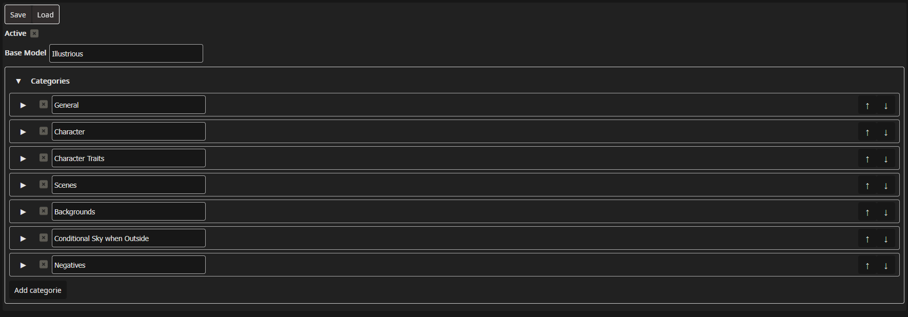
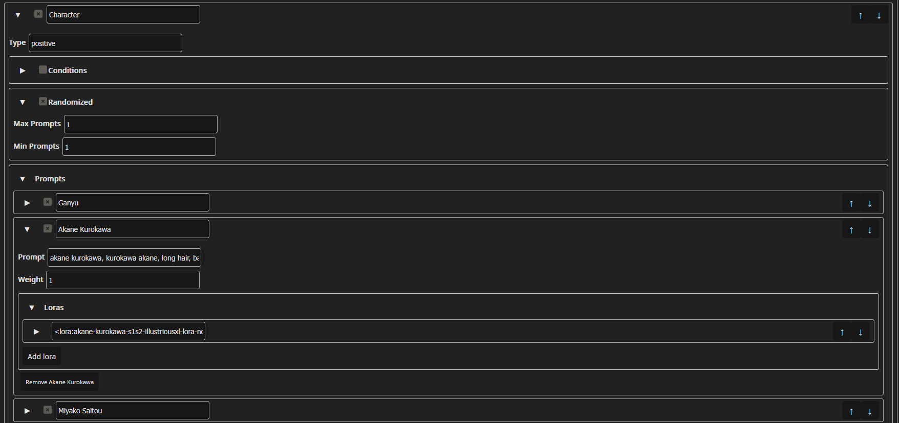
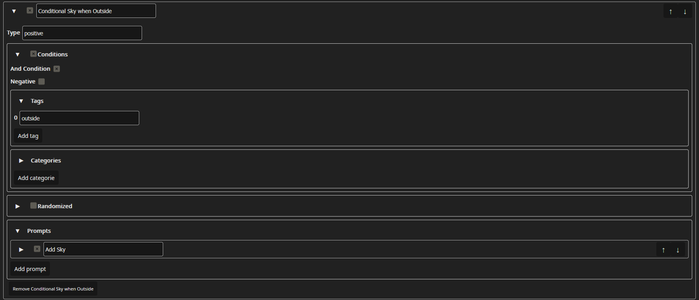

# Prompt Build Helper

Simple extension for [SD.Next](https://github.com/vladmandic/sdnext/) to help building and randomizing prompts.
It will internally overwrite the positive and negative prompt, by building a custom one given by the parameters.
It will generate the same prompt when using a batch size higher than 1, but when using the generate forever feature it will generate a new prompt for every image.

This was created to handle a tag like prompting style which is used for generating anime pictures, the tags should be divided by a comma `,`.
It will remove any duplicate tags and cleanup up the prompt, it will not change the order of the tags.

A log of all prompts will be saved in the data dir under `extensions\prompt-build-helper\log.log`.
The config is also saved there under `extensions\prompt-build-helper\config.json`.

## Usage

1. When installed, a new tab appears on the left side.
   - Pressing `Save` will save the config to disk, the generation always uses the config saved on disk.
   - Pressing `Load` will load the config from disk, overwriting any changes made in the UI. Will be automatically done once on startup.
   - The extension can be disabled by toggling the `Active` combobox at the top of the Window and saving to disk.
2. Add any number of categories, prompts etc. Can also be done while generation is active as you need to press save to change the inputs for the generation.
3. By pressing the generate button you would normally use to start a generation, the extension will intercept before the generation starts and overwrite the positive and negative prompt if any categories have their type.
4. Check in the console if `Prompt Build Helper: Changing positive prompt to` appears. If it worked once, it shouldn't break.
5. Profit.
 
## Intention

### Randomization
Is to be used to generate images with set variances randomly.
For example swapping the character in every image, the background, the scene, the hairstyle, the clothing etc.
The extension is compatible with LoRAs, so they will be loaded on demand. 
It doesn't automatically download the LoRAs so be warned.

### Conditional Prompting
Can also conditionally add expand prompts, for example if the prompt contains `outside` always add `sky, clouds, sun,`.

## Sample Config
A sample config will be loaded when no config has been saved by the user.

The Config will:
- always add the `General` category and the included `Anime Style` prompt 
- Pick one prompt from the `Character` category
- Pick one prompt form the `Character Traits` category
- Pick one prompt form the `Scenes` category
- Pick one prompt form the `Backgrounds` category
- Conditionally add `sky, clouds, sun,` to the prompt when `outside` is present
- Add the `Negatives` category to the negative prompt

A resulting positive prompt may look like:
`masterpiece, best quality, amazing quality, anime, anime screencap, miyako saitou, saitou miyako, long hair, brown hair, brown eyes, <lora:miyako-saitou-s1-illustriousxl-lora-nochekaiser:1.0>, high ponytail, jogging, running, outside, trees, park, sky, clouds, sun,`

## Docs

### Config

#### Active
If the extension should overwrite the prompts

#### Base Model
A reference name to the current base model in use.
This can be any name and will enable LoRAs with the same name referenced to be loaded in the prompt, does not actually have to be the name of any model, just a reference name for you to use.

### Category

#### Header
In the header is a combobox to enable/disable the entire category and the name of the category.

#### Type
Either `positive` or `negative`. Decides in which prompt the category will be used.

### Category Conditions
If enabled, will look through already added tags and categories and decide if this category should be added.

#### Header
The combobox in the header decides if the category should be used or not, default is `false` so the category will always be used.

#### And Condition
If enabled, the given tags and categories all have to be present. If disabled, only one of them needs to be present.

#### Negative
If enabled, will ignore the category when conditions are met. If disabled, will add the category when conditions are met.

#### Tags
A list of tags to be searched for.

#### Categories
A list of category names to be searched for.

### Category Randomized
If enabled, will randomly pick prompts from the category instead of all active ones.
Often 1 max and 1 min prompt is used to pick one prompt for the category.
Is influenced by the weights of the prompts in the category.

#### Header
The combobox in the header decides if the category should be randomized or not, default is `false` so all prompts are added.

#### Max Prompts
Defines the max number of prompts to pick, set to -1 to set the limit to the amount of tags the category has.

#### Min Prompts
Defines the min number of prompts to pick.

### Prompts
Defines the actual prompts to be used in the generation.

#### Header
In the header is a combobox to enable/disable the prompt and the name of the prompt.

#### Prompt
The actual text to add to the prompt.

#### Weight
The weight to use for randomization, default is 1, setting it to 2 for example doubles the chance of it being picked.

### Loras
Defines which LoRAs to use when certain base models are used.

#### Header
In the header is the actual text to be added to the prompt when the base model matches. Should be something along `<lora:akane-kurokawa-s1s2-illustriousxl-lora-nochekaiser:1.0>`.

#### Base Model Type
Defines on which base model the LoRA text will be added, should match the base model from the config.